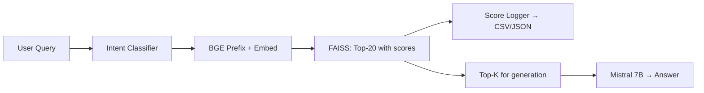

# Phase 0 Week 1 — Walkthrough

## What Was Built

Phase 0 Week 1 establishes the clean baseline and score collection infrastructure. Every retrieval now saves its full similarity score vector — this raw data is your research material for Phase 1.

### Files Created / Modified

| File | Status | Purpose |
|------|--------|---------|
| [config.py](file:///d:/Programming/AI/RAG/food_domain_rag/src/config.py) | NEW | Centralized settings: model, chunk params, paths, K_MAX |
| [score_logger.py](file:///d:/Programming/AI/RAG/food_domain_rag/src/score_logger.py) | NEW | Persists score curves to CSV + JSON |
| [analyze_curves.py](file:///d:/Programming/AI/RAG/food_domain_rag/src/analyze_curves.py) | NEW | Computes kurtosis/entropy/slope, generates plots |
| [sample_queries.txt](file:///d:/Programming/AI/RAG/food_domain_rag/data/sample_queries.txt) | NEW | 40 diverse queries across all intent types |
| [ingest.py](file:///d:/Programming/AI/RAG/food_domain_rag/src/ingest.py) | REWRITTEN | 512/100 chunks, sentence-aware, BGE normalized, richer metadata |
| [rag_query.py](file:///d:/Programming/AI/RAG/food_domain_rag/src/rag_query.py) | REWRITTEN | K_MAX=20 retrieval with `similarity_search_with_score()`, score logging, batch mode |
| [requirements.txt](file:///d:/Programming/AI/RAG/food_domain_rag/requirements.txt) | UPDATED | Added scipy, scikit-learn, numpy, matplotlib, seaborn |

### Architecture



## What Was Verified

- **Ingestion**: 5000 Yelp reviews → **8876 chunks** in FAISS (chunk_size=512, overlap=100)
- **BGE embeddings**: Normalized, on CUDA, batch_size=64
- **Retrieval**: `similarity_search_with_score()` returns L2² distances, correctly converted to cosine similarity via `cos_sim = 1 - L2²/2`
- **Dependencies**: scipy, scikit-learn, numpy, matplotlib, seaborn all installed

## Next Steps for the User

### 1. Make sure Ollama Mistral is running
```bash
ollama serve
# In another terminal:
ollama run mistral
```

### 2. Run batch queries to collect score curves
```bash
cd d:\Programming\AI\RAG\food_domain_rag
d:\Programming\AI\RAG\food_domain_rag\myenv\Scripts\python.exe src/rag_query.py --batch data/sample_queries.txt
```
This will retrieve K=20 candidates for each of the 40 queries and save all score curves to `data/score_curves/`.

### 3. Analyze the curves (the "aha moment")
```bash
d:\Programming\AI\RAG\food_domain_rag\myenv\Scripts\python.exe src/analyze_curves.py
```
This computes kurtosis, entropy, slope for each curve and generates a plot at `results/score_curves_overview.png`.

### 4. Look at the plot
Different query types should produce visually different curve shapes. **That moment — seeing the taxonomy in real data — is where Phase 1 begins.**


------------------------------------------------////------------------------------------

100 similarity score curves collected and analyzed. Here are the key results:

Score Curve Statistics

Feature	Min → Max	Interpretation
Kurtosis	-1.50 → 8.44	Flat/uniform → extremely peaked
Score Range	0.014 → 0.126	Tight cluster → clear top candidate
Slope	-0.009 → -0.001	Sharp decay → gentle decay


Intent Distribution from Current Classifier
general: 62 queries (many queries fall here — classifier too coarse)
recommendation: 17
aspect: 13
complaint: 8
📊 Output Files
data/score_curves/retrieval_scores.csv — all 100 queries with scores
data/score_curves/curve_data.json — full score vectors + LLM responses
results/curve_features.json — computed kurtosis/entropy/slope/range
results/score_curves_overview.png — visual plot of curve shapes
Key Observation
The kurtosis range (-1.5 to 8.4) confirms that different queries produce fundamentally different shaped distributions — exactly the structured signal your paper's thesis is about!

Ready for Week 2
When you're ready, say the word and I'll start Week 2: auto-generating 200 Q&A pairs from the Yelp reviews using Mistral 7B for the evaluation dataset.